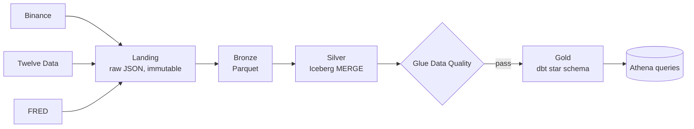
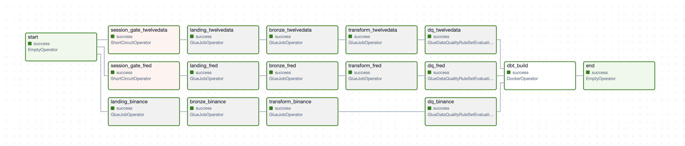
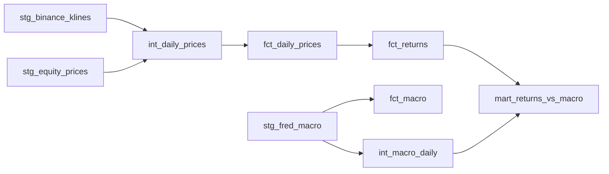

# financial-data-lakehouse

[](https://github.com/phuonganh0804/financial-data-lakehouse/actions/workflows/ci.yml)

A medallion-architecture data lakehouse for financial market data on AWS. Crypto
(Binance), equities (Twelve Data), and macro (FRED) flow through
`landing → bronze → silver → data quality → dbt gold`, orchestrated by Airflow and
provisioned with Terraform.

## Purpose

Financial analysts and quantitative researchers often spend significant effort collecting and reconciling market and macroeconomic data. This platform automates ingestion, validation, and transformation into analytics-ready datasets for risk analysis and quantitative research.

## Architecture



*Terraform provisions every AWS resource **and** the Glue job scripts; Airflow orchestrates `landing → bronze → silver → DQ → dbt` daily, per source.*

| Layer | Tech | Purpose |
|---|---|---|
| **Landing** | Glue Python Shell | Raw API responses, byte-for-byte, immutable (append-only by `run_id`) |
| **Bronze** | Glue Spark | Parsed/structured to columnar Parquet, partitioned by `ingest_date` |
| **Silver** | Glue Spark + Iceberg | Typed, deduped, `MERGE` on natural keys `(entity, date)` |
| **Data quality** | Glue Data Quality (DQDL) | Row-level rules that gate the gold build |
| **Gold** | dbt-athena | Star-schema marts (e.g. returns vs. macro) |
| **Orchestration** | Airflow | Daily `landing → bronze → silver → DQ → dbt` per source |
| **IaC** | Terraform | All AWS resources **and** the Glue job scripts |

The Airflow DAG that runs it — one branch per source, with trading-calendar
**session gates** up front and a **Glue DQ → `dbt build`** gate before gold:



## Data model (gold)

dbt builds a **star schema** in Athena (`financial_data_lakehouse_gold`):

- **Dimensions** - `dim_date` (calendar), `dim_symbol` (`(exchange, symbol)` → `symbol_key`, `asset_class ∈ {crypto, equity}`), `dim_series` (FRED series reference: name, frequency, unit).
- **Facts** - `fct_daily_prices` (OHLCV, one instrument/day), `fct_returns` (daily & log returns + 30-day rolling volatility), `fct_macro` (one FRED series/day). Each fact carries a surrogate key and `relationships` (foreign-key) tests back to its dimensions.
- **Report mart** - `mart_returns_vs_macro`: every asset's daily return aligned with **forward-filled** daily macro (fed funds, 10Y yield, 10Y inflation expectation, CPI, real GDP), plus a derived YoY inflation (`cpi_yoy`) and an approximate inflation-adjusted `real_daily_return`. Monthly CPI and quarterly GDP are carried forward to every trading day so low-frequency macro lines up with daily returns.



### Example query

```sql
-- Real (inflation-adjusted) daily returns by asset class for 2025,
-- against the prevailing macro backdrop.
select
    asset_class,
    count(*)                               as obs,
    round(avg(daily_return)      * 100, 4) as avg_daily_return_pct,
    round(avg(real_daily_return) * 100, 4) as avg_real_return_pct,
    round(avg(volatility_30d)    * 100, 2) as avg_30d_vol_pct,
    round(avg(fed_funds_rate),   2)        as avg_fed_funds,
    round(avg(cpi_yoy)           * 100, 2) as avg_cpi_yoy_pct
from financial_data_lakehouse_gold.mart_returns_vs_macro
where date_day >= date '2025-01-01' and date_day < date '2026-01-01'
group by asset_class
order by asset_class;
```

| asset_class | obs | avg_daily_return_pct | avg_real_return_pct | avg_30d_vol_pct | avg_fed_funds | avg_cpi_yoy_pct |
|---|---|---|---|---|---|---|
| crypto | 730 | 0.025 | 0.0177 | 3.0 | 4.21 | 2.69 |
| equity | 2000 | 0.0859 | 0.0786 | 2.29 | 4.21 | 2.69 |


## Setup

### Prerequisites
- AWS credentials with permission to create Glue, S3, Athena, Glue Data Catalog, IAM, and SSM resources.
- Terraform, Docker (for Airflow + dbt), AWS CLI.
- Config files are gitignored (account/run-specific) - copy each from its committed `.example`: `terraform/backend.hcl` (S3 state backend), `terraform/terraform.tfvars` (run dates + interval), and `airflow/.env` (Terraform outputs).

Store the FRED API key in SSM (read at runtime by the landing job - never committed):
```bash
aws ssm put-parameter \
  --name /financial-data-lakehouse/fred-api-key \
  --type SecureString \
  --value "<your-fred-api-key>" \
  --region eu-central-1
```

### 1. Deploy infrastructure
```bash
cd terraform
cp backend.hcl.example backend.hcl            # Terraform state S3 bucket
cp terraform.tfvars.example terraform.tfvars  # run dates + interval
terraform init -backend-config=backend.hcl
terraform apply
```
Creates the Glue jobs, S3 buckets, Iceberg catalog, DQ rulesets, and Athena
workgroup, and uploads the job scripts. **All job IAM roles and policies are
provisioned here — no manual IAM setup.**

### 2. Backfill history (optional, one-off)
Airflow runs with `catchup=False`, so it only ingests **forward from now**. To load
history — a fresh deploy, or a newly added series/symbol — run the bulk backfill
(landing → bronze → transform per source over a wide date range, **outside**
Airflow):
```bash
chmod +x scripts/backfill.sh
./scripts/backfill.sh 2024-01-01 2026-06-20          # all sources
./scripts/backfill.sh 2024-01-01 2026-06-20 fred     # one source
```
This is far cheaper and faster than an Airflow catch-up: **one wide-range Glue job
per stage** instead of ~one DAG run per day (which would be hundreds of job
invocations paying Spark startup over and over). Skip it if you only need data
going forward.

### 3. Start orchestration
```bash
cd airflow
cp .env.example .env        # fill in Terraform outputs: bucket names, role ARN, keys
docker compose up -d
# open http://localhost:8080 and unpause the `financial_data_lakehouse` DAG
```
The containers authenticate to AWS via your host's `~/.aws` credentials
(bind-mounted in). From here the DAG runs daily, ingesting each new session forward.

## History vs. incremental

Two distinct mechanisms keep the lakehouse current, and they never conflict,
because silver `MERGE`s on natural keys (both paths converge to one row per
entity/date):

- **Incremental (ongoing)** - the Airflow DAG, daily. Each run fetches a single
  `ds` (crypto/equities) or a cadence-sized **lookback window** (FRED, so the
  latest late-released observation is always captured). This is the steady state.
- **Backfill (history)** - `scripts/backfill.sh`, on demand. Fetches a wide
  `[api_start_date, api_end_date]` range in one shot. The whole range lands under
  one `ingest_date` batch; the real time axis is each row's `date` column.

Trading-calendar gates (NASDAQ for equities, SIFMA for FRED) skip weekends and
market holidays automatically, so the strict landing jobs only run when there is
data to fetch.

## Quality & testing

Quality is enforced at three levels - pre-merge, runtime, and analytics:

1. **CI — static checks on every push/PR** (`.github/workflows/ci.yml`, credential-free, no AWS needed):
   - `ruff` (real-error rules) + `py_compile` across all Glue/Airflow Python;
   - **seed-drift** — regenerates the dbt coverage seed from the Terraform configs and fails if it diverges from what's committed;
   - `terraform fmt -check` + `validate` (`-backend=false`);
   - `dbt parse` against the committed profile — builds the manifest and catches model/macro/schema errors offline.
2. **Glue Data Quality — runtime row rules that gate the gold build.** Each silver table has a DQDL ruleset (`binance_dq_ruleset`, `twelvedata_dq_ruleset`, `fred_dq_ruleset`) asserting `RowCount > 0`, completeness (`IsComplete` on keys/OHLCV), and validity (`ColumnValues "close" > 0`, `volume >= 0`). The DAG runs these after silver and **only triggers `dbt build` if every source's checks pass** — bad data never reaches gold.
3. **dbt tests — the analytics contract.** Schema tests on the marts: `not_null`/`unique` on surrogate keys, `relationships` (foreign-key integrity from every fact back to its dimensions), and `accepted_values` on `asset_class`. Run as part of `dbt build`.

## Design decisions & known limitations

- **Twelve Data landing is intentionally not paginated.** The `time_series`
  endpoint caps each response at `outputsize` (max **5000 rows**, not a time span).
  Daily backfills here are scoped to recent history, which is well under the cap, so a
  single request is complete. Pagination is deliberately skipped: it would be
  untestable against the free tier's limited history depth, and `landing_binance.py`
  (a hard 1000-rows/request cap) already demonstrates the paging pattern. To go
  deeper later, either add date-windowed pagination (fetch newest-first, advance
  `end_date` until a page returns `< outputsize`) or switch to a coarser interval
  (monthly ≈ 416 years per 5000 points) if low-frequency grain is acceptable.
