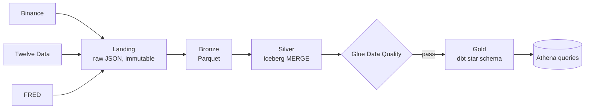
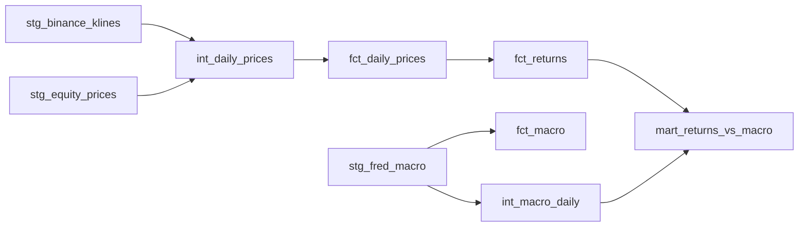

# financial-data-lakehouse

[](https://github.com/phuonganh0804/financial-data-lakehouse/actions/workflows/ci.yml)

An end-to-end **data lakehouse on AWS** for financial market data, and a **SQL
analysis** built on it. Daily crypto (Binance), equity (Twelve Data) and US macro
(FRED) data flow through `landing → bronze → silver → data quality → dbt gold`,
orchestrated by Airflow and provisioned with Terraform. The
[analysis](analysis/FINDINGS.md) asks how big tech, crypto and the Nasdaq-100
performed through the 2021–2026 interest-rate cycle.

**Stack:** Python · PySpark · SQL · dbt · Apache Airflow · AWS (S3, Glue, Athena,
IAM, SSM) · Apache Iceberg · Terraform · Docker · GitHub Actions

## Key findings

From [the analysis](analysis/FINDINGS.md) of 8 US tech megacaps, the Nasdaq-100
ETF (QQQ) and BTC/ETH, 2021-01 → 2026-09:

| Topic | Finding |
|---|---|
| Risk-adjusted | **The index beat most of its stars on risk-adjusted terms.** Only NVDA and GOOGL had a better Sharpe ratio than simply holding QQQ (0.58), and QQQ had the lowest volatility of any asset. |
| Concentration | **The "average tech stock" is a story about NVDA.** The 8 stocks averaged +305%, but the median one returned +141%, about the same as QQQ's +136%. |
| Rate cycle | **Crypto was the most rate-sensitive asset:** +164% at zero rates, −33% while the Fed hiked to 5.33%. For QQQ, hiking mainly raised risk: volatility went from 16% to 28%. |
| Inflation | **Inflation turned a 15% loss into a 25% one.** In 2021–22 QQQ fell 15% in nominal terms, but CPI rose 14%, so investors lost a quarter of their purchasing power. |

Every number comes from a query in [`analysis/sql/`](analysis/sql/), with
caveats (survivorship bias, one rate cycle) and a plain-language glossary in
[FINDINGS.md](analysis/FINDINGS.md).

## Highlights

- **Trustworthy data.** Four layers of quality checks form a closed loop
  (validity → freshness → per-asset recency → coverage), plus 40 dbt tests. Bad
  data never reaches the reporting layer.
  → [Data quality & lineage](docs/data-quality-and-lineage.md)
- **Every number is traceable.** Row-level lineage (`run_id`, `source_file`) links
  each value to the exact raw API response, and Iceberg snapshots show past states.
  → [Lineage & auditability](docs/data-quality-and-lineage.md#lineage--auditability)
- **Right-sized storage.** Re-partitioning the Iceberg tables cut 27k one-row files
  to 28, and a load that timed out at 10 minutes now takes about 2.
  → [Design decisions](docs/design-decisions.md)
- **Correctness bugs caught and fixed:** unadjusted stock splits (fake −90% days),
  and a real-return formula that under-deflated equities by about 30%.
  → [Design decisions](docs/design-decisions.md) ·
  [the analysis](analysis/FINDINGS.md#data-issue-found-during-this-analysis)
- **History and daily runs converge.** Bulk backfills and daily Airflow runs upsert
  into the same tables without duplicates.
  → [History vs. incremental](docs/setup.md#history-vs-incremental)

## Architecture


```mermaid
flowchart LR
  B[Binance] --> L
  T[Twelve Data] --> L
  F[FRED] --> L
  L["Landing<br/>raw JSON, immutable"] --> Z["Bronze<br/>Parquet"]
  Z --> S["Silver<br/>Iceberg MERGE"]
  S --> DQ{"Glue Data Quality"}
  DQ -->|pass| G["Gold<br/>dbt star schema"]
  G --> Q[("Athena queries")]
```

*Terraform provisions every AWS resource **and** the Glue job scripts; Airflow orchestrates `landing → bronze → silver → DQ → dbt` daily, per source.*

| Layer | Tech | Purpose |
|---|---|---|
| **Landing** | Glue Python Shell | Raw API responses, byte-for-byte, immutable (append-only by `run_id`) |
| **Bronze** | Glue Spark | Parsed/structured to columnar Parquet, partitioned by `ingest_date` |
| **Silver** | Glue Spark + Iceberg | Typed, deduped, `MERGE` on natural keys `(entity, date)`; partitioned by year; row-level lineage back to landing |
| **Data quality** | Glue Data Quality (DQDL) | Row-level rules that gate the gold build |
| **Gold** | dbt-athena | Star-schema marts (e.g. returns vs. macro) |
| **Orchestration** | Airflow | Daily `landing → bronze → silver → DQ → dbt` per source |
| **IaC** | Terraform | All AWS resources **and** the Glue job scripts |

The Airflow DAG that runs it - one branch per source, with trading-calendar
**session gates** up front and a **Glue DQ → `dbt build`** gate before gold:


## Data model (gold)

dbt builds a **star schema** in Athena (`financial_data_lakehouse_gold`):

- **Dimensions** - `dim_date` (calendar), `dim_symbol` (`(exchange, symbol)` → `symbol_key`, `asset_class ∈ {crypto, equity}`, `is_benchmark` flags QQQ), `dim_series` (FRED series reference: name, frequency, unit).
- **Facts** - `fct_daily_prices` (OHLCV, one instrument/day), `fct_returns` (daily & log returns + 30-day rolling volatility), `fct_macro` (one FRED series/day). Each fact carries a surrogate key and `relationships` (foreign-key) tests back to its dimensions.
- **Report mart** - `mart_returns_vs_macro`: every asset's daily return aligned with **forward-filled** daily macro (fed funds, 10Y yield, 10Y inflation expectation, CPI, real GDP), plus a derived YoY inflation (`cpi_yoy`) and an approximate inflation-adjusted `real_daily_return`. Monthly CPI and quarterly GDP are carried forward to every trading day so low-frequency macro lines up with daily returns.


```mermaid
flowchart LR
  sb[stg_binance_klines] --> idp[int_daily_prices]
  se[stg_equity_prices] --> idp
  sf[stg_fred_macro] --> imd[int_macro_daily]
  sf --> fm[fct_macro]
  idp --> fdp[fct_daily_prices]
  fdp --> fr[fct_returns]
  fr --> mart[mart_returns_vs_macro]
  imd --> mart
```

### Example query

```sql
-- Real (inflation-adjusted) daily returns by asset class for 2025,
-- against the prevailing macro backdrop.
select
    asset_class,
    count(*)                               as obs,
    round(avg(daily_return)      * 100, 4) as avg_daily_return_pct,
    round(avg(real_daily_return) * 100, 4) as avg_real_return_pct,
    round(avg(volatility_30d)    * 100, 2) as avg_30d_vol_pct,
    round(avg(fed_funds_rate),   2)        as avg_fed_funds,
    round(avg(cpi_yoy)           * 100, 2) as avg_cpi_yoy_pct
from financial_data_lakehouse_gold.mart_returns_vs_macro
where date_day >= date '2025-01-01' and date_day < date '2026-01-01'
  and not is_benchmark                    -- QQQ is a yardstick, not part of 'equity'
group by asset_class
order by asset_class;
```

| asset_class | obs | avg_daily_return_pct | avg_real_return_pct | avg_30d_vol_pct | avg_fed_funds | avg_cpi_yoy_pct |
|---|---|---|---|---|---|---|
| crypto | 730 | 0.025 | 0.0177 | 3.0 | 4.21 | 2.69 |
| equity | 2000 | 0.0859 | 0.0753 | 2.29 | 4.21 | 2.69 |

## Documentation

| Doc | What's in it |
|---|---|
| [Analysis findings](analysis/FINDINGS.md) | The 5 questions, results, caveats and a glossary of finance terms |
| [Data quality & lineage](docs/data-quality-and-lineage.md) | CI checks, Glue Data Quality, dbt tests, the 4-layer quality loop, lineage columns, auditability |
| [Design decisions](docs/design-decisions.md) | Split adjustment, partitioning, newest-run-wins, known limitations |
| [Setup & operations](docs/setup.md) | Deploy, backfill, run Airflow, how daily runs and backfills fit together |
| [dbt project](dbt_modeling/README.md) | The gold-layer models |

## Quick start

```bash
(cd terraform && terraform init -backend-config=backend.hcl && terraform apply)
bash scripts/backfill.sh 2020-01-01 <yesterday>   # optional: load history
(cd airflow && docker compose up -d)              # then unpause the DAG at :8080
```

Prerequisites, API keys and config files: see [Setup & operations](docs/setup.md).
